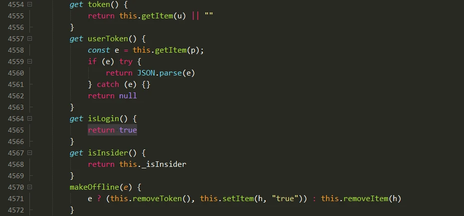

# 解决EgretLauncher登录问题

需要修改的subpage.js文件路径
windows:
```shell
C:\Program Files (x86)\Egret\EgretLauncher\resources\app\out\app\electron-browser\subpage.js
```
macos :
```shell
/Applications/EgretLauncher.app/Contents/Resources/app/out/app/electron-browser/subpage.js
```

可以使用HBuilderX格式化代码,用vscode效果不佳
修改subpage.js大概 4564 行的 get isLogin()函数，直接return true

 
如果是Mac版本可以直接从小游戏支持包下载的 Mac版本的_subpage.js/subpage.js，替换前请将 subpage.js 中 /Users/rontian 批量搜索替换成你本机的账户