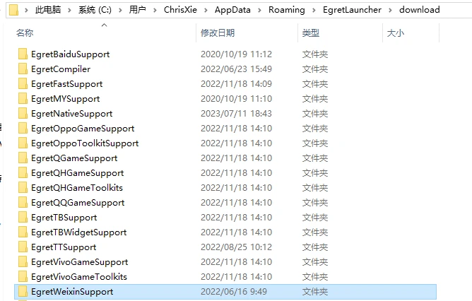
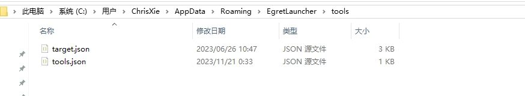
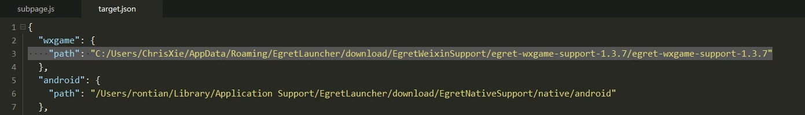
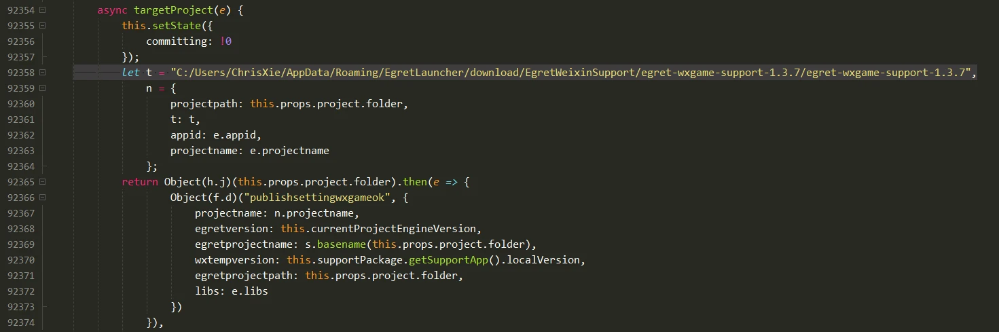
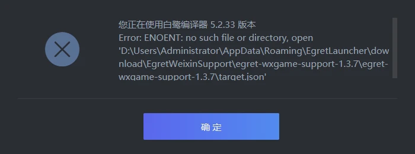

1.根据系统找到EgretLauncher在本地的缓存目录位置
windows:
```shell
C:\Users\当前用户\AppData\Roaming\EgretLauncher\download
```
macos :
```shell
/Users/当前用户/Library/Application Support/EgretLauncher/download
```
安卓支持包(小游戏支持包)下载地址：https://www.egret.com/download/ 
将下载的supports_download.zip解压内容到 download 目录 下即可

 
 2.添加target.json文件
```shell
C:\Users\Administrator\AppData\Roaming\EgretLauncher\tools
```
该目录目录添加target.json文件，从下载的小游戏支持包中的tools文件中拷贝进来

并且打开target.json文件修改target.json文件wxgame地址
windows:
```shell
let t = "C:/Users/当前用户/AppData/Roaming/EgretLauncher/download/EgretWeixinSupport/egret-wxgame-support-1.3.7/egret-wxgame-support-1.3.7",
```
macos :
```shell
let t = "/Users/当前用户/Library/Application Support/EgretLauncher/download/EgretWeixinSupport/egret-wxgame-support-1.3.7/egret-wxgame-support-1.3.7",
```

 
3.微信小游戏配置游戏包
微信小游戏及其他平台小游戏发布需要修改subpage.js中，查找下行代码相关的位置
```shell
await Object(tt.c)(this.supportPackage.getSupportApp()),
```
大概能找到12处与上述代码相同的地方,可以全部替换也可以单独修改微信小游戏部分
微信小游戏相关代码大概在 92358 行，可从此行代码下文看到类似wxgame相关的标识来确定是哪个小游戏平台，直接将let t = await Object(tt.c)(this.supportPackage.getSupportApp()),修改为本地缓存的路径即可,如:
windows:
```shell

let t = "C:/Users/当前用户/AppData/Roaming/EgretLauncher/download/EgretWeixinSupport/egret-wxgame-support-1.3.7/egret-wxgame-support-1.3.7",
```

macos :
```shell
let t = "/Users/当前用户/Library/Application Support/EgretLauncher/download/EgretWeixinSupport/egret-wxgame-support-1.3.7/egret-wxgame-support-1.3.7",
```



4.总结
*** 在配置完后需要重启 Egret Launcher

*** 至此微信小游戏的发布配置就完成了,其他类目的小游戏以此类推
发布步骤可以参考:使用egret引擎开发微信小游戏项目基本搭建步骤
更多配置问题可以阅读官网文档：微信小游戏开发指南
*** 如果出现该报错：Error: ENOENT: no such file or directory, open 

把项目拷贝到配置的 C盘 目录中发布

