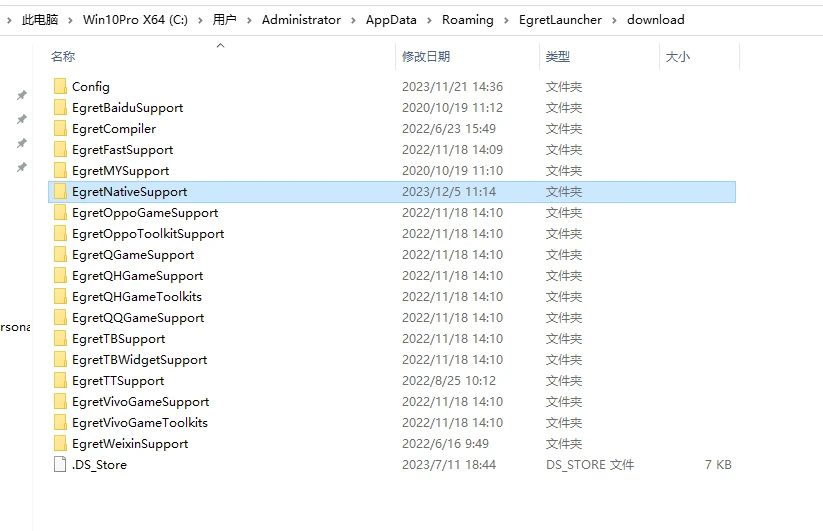
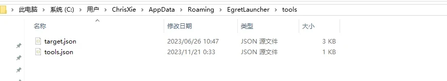
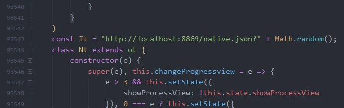

1.根据系统找到EgretLauncher在本地的缓存目录位置
windows:
```shell
C:\Users\当前用户\AppData\Roaming\EgretLauncher\download
```
macos :
```shell
/Users/当前用户/Library/Application Support/EgretLauncher/download
```
安卓支持包(小游戏支持包)下载地址：https://www.egret.com/download/ 

将下载的supports_download.zip解压内容到 download 目录 下即可



 2.添加target.json文件
```shell
C:\Users\Administrator\AppData\Roaming\EgretLauncher\tools
```
该目录目录添加target.json文件，从下载的小游戏支持包中的tools文件中拷贝进来



并且打开target.json修改target.json文件android地址

windows:
```json
  "android": {
    "path": "C:\\Users\\Administrator\\AppData\\Roaming\\EgretLauncher\\download\\EgretNativeSupport\\native\\android"
  },
```
macos :
```json
  "android": {
    "path": "/Users/当前用户/AppData/Roaming/EgretLauncher/download/EgretNativeSupport/1.1.2/android"
  },
```
 

3.搭建Web服务器提供Egret发布原生支持包下载
由于Egret官网服务已经不提供下载，所以需要本地配置一个web服务器来提供下载，也可以使用云服务器自行搭建。

推荐本地搭建方式，教程在另一篇帖子： 如何在windows本地搭建Nginx和Tomcat服务器给Egret白鹭Native平台发布无法下载原生支持包问题 

 

在 https://www.egret.com/download/ 中下载小游戏支持包后，解压后把

native.json 

android_1443523c87b1552163490a89d901451d.zip

ios_4a449a853ff59e2b3c8cd2bc5d474a13.zip

 三个文件拷贝进去配置的Web服务器静态资源存放目录

并配置native.json，Web服务器提供Egret发布原生支持包地址；http://localhost:8869/ 为我的本地web服务地址 修改你的配置地址即可
```json
{
    "engines": {
        "5.2.33": {
            "supports": [
                "native"
            ]
        }
    },
    "supports": {
        "native": {
            "android": "http://localhost:8869/android_1443523c87b1552163490a89d901451d.zip",
            "ios": "http://localhost:8869/ios_4a449a853ff59e2b3c8cd2bc5d474a13.zip"
        }
    }
}
```
4.原生游戏发布包配置
本地或者云服务搭建好了原生支持包下载环境

需要在subpage.js文件中的 const It  修改成自己搭建好的native.json配置地址如图：



至此就配置好了Egret白鹭安卓(Android)&IOS,Native 发布问题

二,总结
*** 在配置完后需要重启 Egret Launcher

*** 配置完第一次发布会提示 “没有登录，发布失败” 重新再发布一次就行了