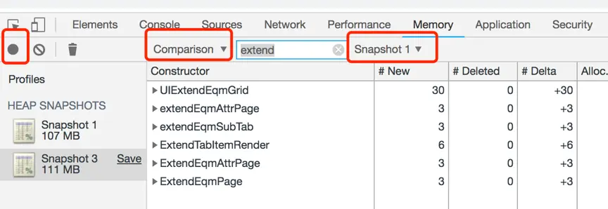
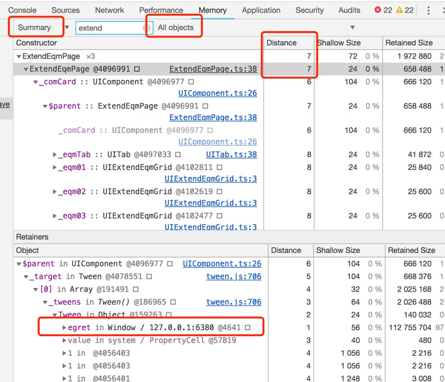

JS内存管理
JS中内存的分配和回收都是虚拟机自动完成的，不需要像C/C++为每一个new/malloc操作去写配对的delete/free代码，不容易出现内存泄漏的问题。JS引擎中对变量的存储主要是在栈内存，堆内存。内存泄漏的实质是应该回收的对象出现意外而没有被回收，而是常驻内存。
GC原理
在堆中查看无用的对象，把这些对象占用的内存空间进行回收。浏览器上的GC(Gabage Collection垃圾回收)实现，大多是采用可达性算法，关于可达性的对象，便是能与GC Roots构成连通图的对象。当一个对象到GC Roots没有任何引用链时，则会成为垃圾回收器的目标，系统会在合适的时候回收它所占的内存。
排查方法
Google浏览器提供了非常强大的JS调试工具，Head Profiling便是其中一个。它可以记录当前的堆内存快照，并生成对象的描述文件，包括js运行时所用到的所有对象，对象所占用内存大小，引用的层级关系等。
 
1.打开Google浏览器，打开要监控的网页，win下按F12弹出开发者工具
 

2.切换到Memory，选择堆类型，选中Take Heap SnapShot开始进行快照
 

3.右边的视图列出了heap里的对象列表，点击对象可以看到对象的引用层级关系
 

4.进入游戏后拍下快照，打开某个界面，关闭界面，拍下快照
 

5.将新的快照转换到Comparsion对比视图，进行内存对比分析
 

注意:每次拍快照前，都会先自动执行一次GC，保证视图里的对象都是root可及的。GC的触发是依赖浏览器的，所以不能通过时时观察内存峰值而判断是否有内存泄漏。
 

 
 

 

Distance: 对象到根的引用层级距离
 

问题集合
游戏里观察者模式在添加通知后，没有清理监听造成的内存泄漏现象较多。
 

特效内存泄漏问题
添加事件:this.addFloatEffect(this.\_comCard,"verticalCenter");对象被Tween引用
 

界面关闭的时候移除监听:this.removeFloatEffect(this.\_imgCard);
 

相关文件: ExtendEqmPage.ts
 

解决与避免: 修改PanelBase.ts->addFloatEffect,把节点自动加入到缓存列表进行自动管理, 关闭的时候自动移除.
 

Notify事件内存泄漏问题
Notify.addEventListener(NotifyType.ROLE\_BRIEF\_INFO,this.\_onNotifyRoleBriefInfo,this);
 

Notify.removeEventListener(NotifyType.ROLE\_BRIEF\_INFO,this.\_onNotifyRoleBriefInfo,this);
 

Notify是一个全局的自定义事件分发器,界面的这种监听就必须移除
 

相关文件:RankViewBase.ts
 

解决与避免: 修改PanelBase.ts, 添加addEvents方法, 规范事件管理.
 

特殊事件内存泄漏问题
this.addEventListener(egret.Event.ENTER\_FRAME, this.\_onEnterFrame, this);
 

Event类型若为ENTER\_FRAME，RENDER，则必须取消监听，因为这种事件的注册监听是通过一个全局列表来维护，跟点击类型事件不一样, 点击类型事件就算不取消监听，也不会造成内存泄露.
 

解决与避免: 使用ENTER\_FRAME，RENDER 事件, 记得要移除.
 

Stage事件内存泄漏问题
this.stage&&this.stage.addEventListener(egret.TouchEvent.TOUCH\_TAP,this.onTouchedStage,this,false,1);
 

this.stage不为null时，它是一个全局的舞台，如果界面操作过程中，this.stage为null，可以通过StageManager.getInstance().stage来获取，并移除事件
 

解决与避免: 尽量不要注册在this.stage上, 因为onClose的时候, this.stage已经被引擎置空, 应该改成this或者通过StageManager.getInstance().stage取值.
 

动态创建子页面的内存泄漏问题
TowerPanel.ts代码片段:
 

let pageInstance = newcqui.god.GodTowerPage();
 

this.\_page.addChild(pageInstance);
 

page的基类是PanelBase,在onFirstOpened ()的时候，注册了Notify事件，正常情况下是需要在onClosed()进行移除，但是因为这个page是通过addChild加到父类GodTowerPanel,panel释放的时候，并没有主动调用page的onClosed(),导致泄漏。
 

所以需要修改GodTowerPage.ts, 加上释放事件:
 

this.addEventListener(egret.Event.REMOVED\_FROM\_STAGE,()=>{this.onClosed();}, this);
 

解决与避免: 在page加一个移除舞台的监听事件，在事件里做其他监听的移除。
标签Tab内存泄漏问题
基类是PanelBase，派生类作为UiTab的数据源（即页签），含有UiTab的界面必须要重写onClosed()函数，然后tab调用clear函数去清除数据源。或者在页签界面添加一个移除舞台时的监听处理去移除其它监听。
 

public onClosed(): void {super.onClosed();this.\_tab.clear();}
 

相关类: DressPanel, DressSuitPage
 

解决与避免: 使用tab的时候要注意调用clear清除数据源.
定时器内存泄漏问题
this.\_countId = egret.setInterval(() => {}, this, 1000);
 

需要在界面移除时调用如下函数:
 

egret.clearInterval(this.\_countId);
 

解决与避免: 使用egret.setInterval的时候要注意移除.
 动画内存泄漏问题
动画缓动类，loop属性为true时
 

egret.Tween.get(this.\_imgHand, {loop :true});
 

也需要在界面关闭时手动调用:
 

egret.Tween.removeTweens(this.\_imgHand);
 

例子:GuideEffect.ts 新手引导特效,被UI界面引用时，导致所有触发引导的界面都会有内存泄漏。UI树上的节点能通过root引用找到时，导致它的父节点也是没法被JS引擎回收。
 