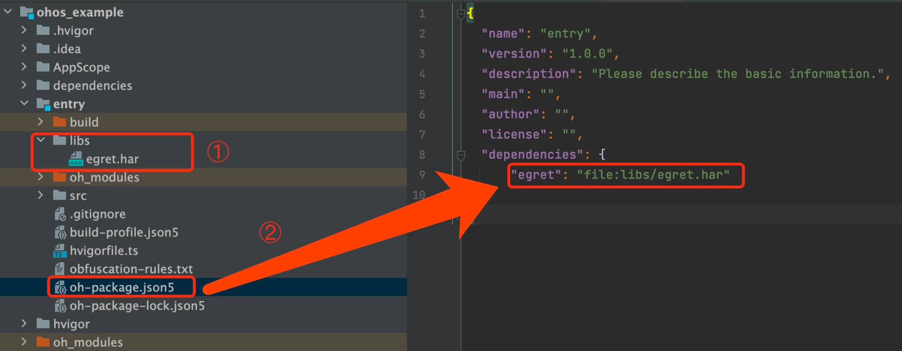
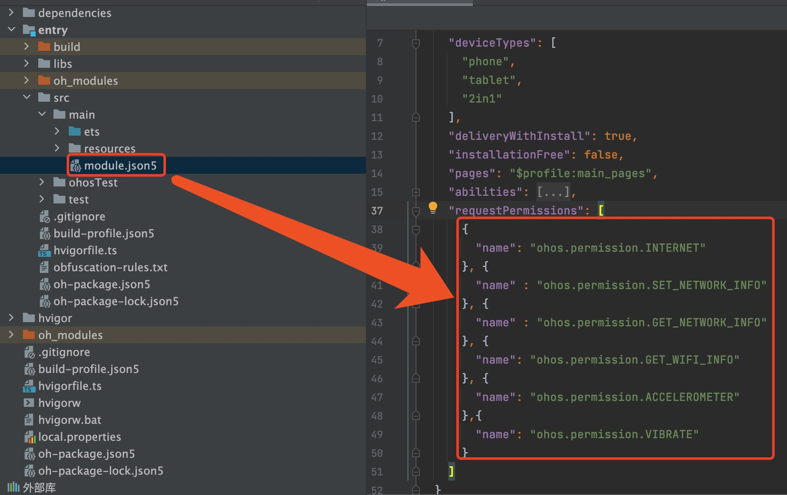
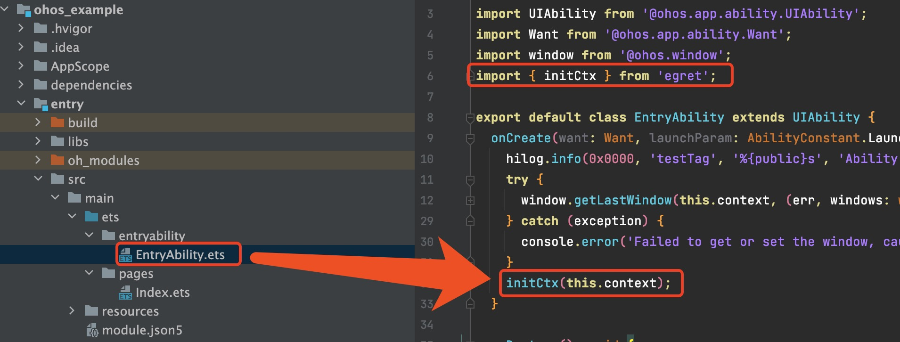
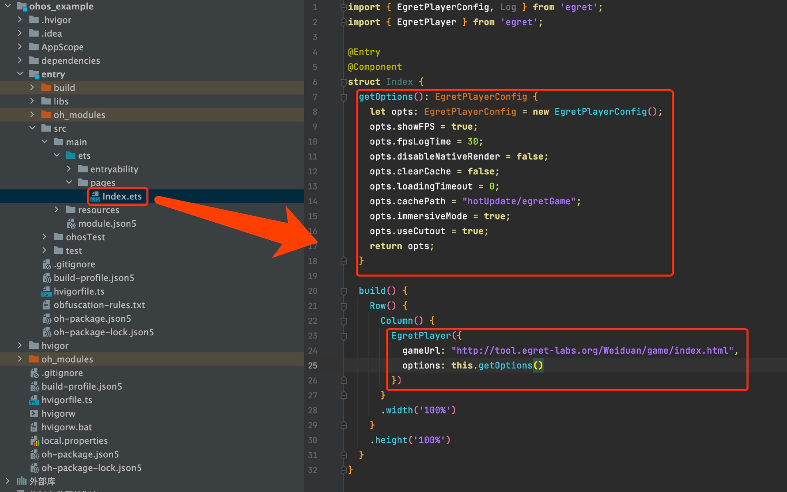
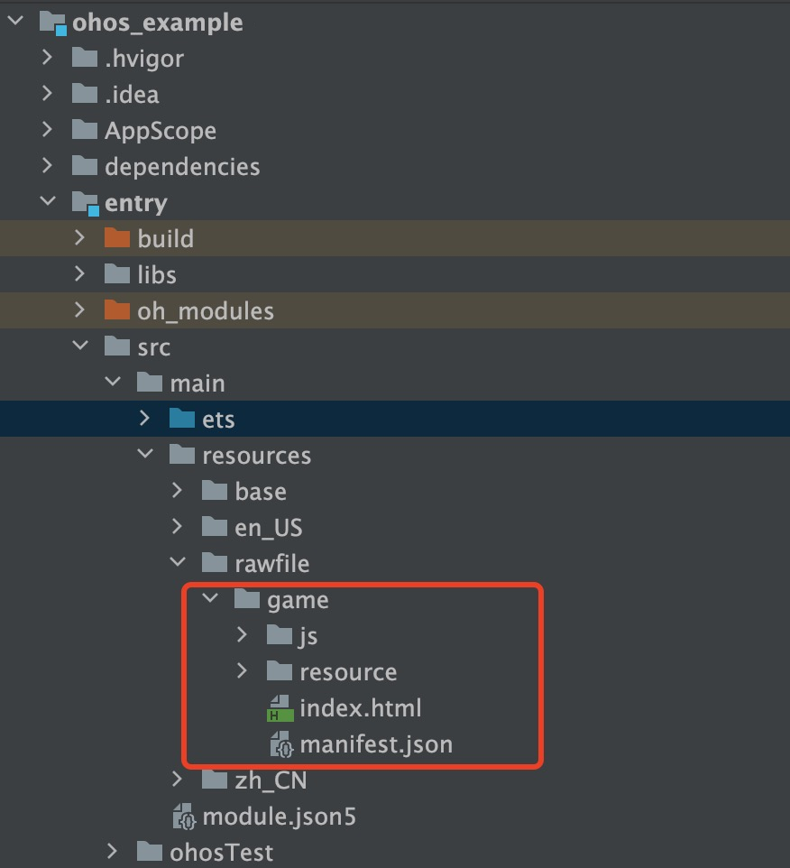
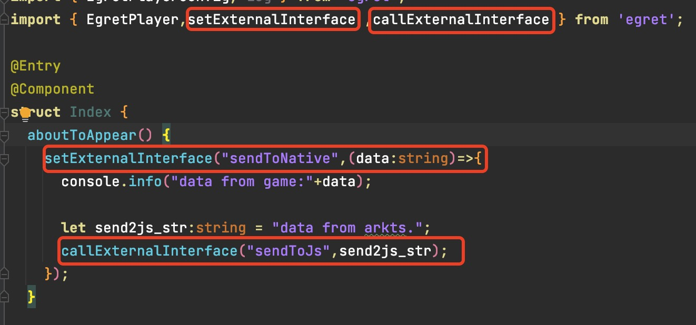
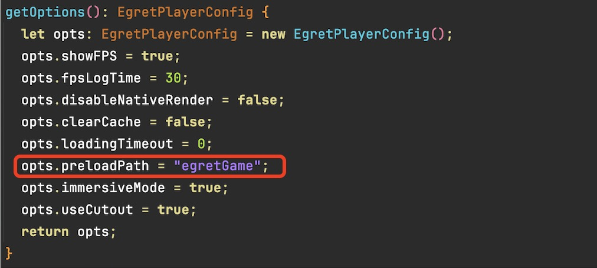

# 环境检查和准备

1.  egret引擎版本支持：engine > 5.2.
2.  鸿蒙sdk版本：5.0.0（12）
3.  DevEco编辑器版本：5.0.3.400以上
	>下载地址:https://developer.harmonyos.com/deveco-developer-suite/
	>以上地址需要申请HarmonyOS Next预览版开发者权限
4. HarmonyOS Next手机系统版本: >= NEXT.0.0.31

# egret接入
1. 创建一个空的鸿蒙项目，sdk版本:5.0.0(12)
2. 拷贝egret.har库文件到鸿蒙项目主模块libs目录下，并在模块配置文件添加引用

1. 根据需要添加模块权限

1. 初始化引擎

1. 页面引入EgretPlayer组件

1. 拷贝发布后的游戏资源到 **resources/rawfiles/game/** 路径下

通过上述步骤，接入工作就完成了。也可以直接使用提供的 **egret_template** 模版项目,更新 **resources/rawfiles/game/** 路径下的游戏资源。接下来就可以开始启动测试游戏

# 原生交互
>**游戏与arkts交互** 主要用于引擎未集成系统功能开发和第三方sdk接入使用。
- 在需要的位置调用 **setExternalInterface** 来监听游戏中**egret.ExternalInterface.call**的方法调用
- 通过 **callExternalInterface** 方法调用游戏中 **egret.ExternalInterface.addCallback** 的方法

# 热更新

游戏运行过程中下载的文件会缓存在本地，参考“原生缓存策略”。

Native中可以通过 **config.preloadPath** 指定预加载目录，runtime加载资源时优先从这个目录查找文件，找不到再去assets目录下查找或者从服务器下载。

查找资源的优先级：预加载目录>本地资源(assets下的资源)>缓存目录(游戏运行过程中动态下载的资源)
