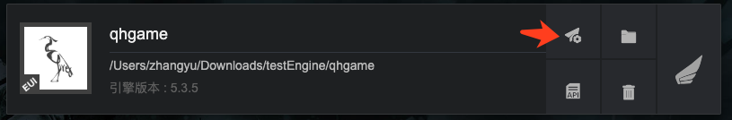
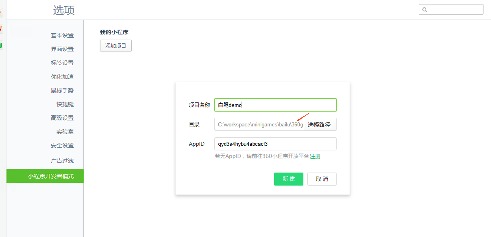
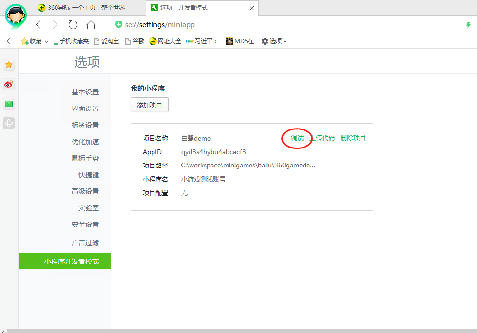

360小游戏是一个以360安全浏览器为主要宿主的游戏平台，平台直接对接360内部浏览器、搜索、导航等流量资源，覆盖PC用户工作、休闲的全场景。360小游戏，让有趣触手可及。

### 一.开发环境准备[​](#一开发环境准备 "一.开发环境准备的直接链接")

- Egret Launcher 1.1.7 以上版本
- 白鹭引擎 5.3.5 以上版本
- 在电脑中安装 [node](https://nodejs.org/) 和 [npm](https://www.npmjs.com/)
- 更多 360 小游戏的文档，请访问小游戏支持网站：[网站地址](https://mp.360.cn/doc/minigame/dev/#/b937848ad4639db60f98e9c2321ee876)

### 二.创建小游戏和可视化编译打包小游戏[​](#二创建小游戏和可视化编译打包小游戏 "二.创建小游戏和可视化编译打包小游戏的直接链接")

1.  使用最新的 Egret Launcher 创建一个 Egret 游戏项目，引擎使用 5.3.5 以上版本。 创建完成后，会在 Egret Launcher 的列表里看到该项目。点击发布设置: 
2.  选择 **360小游戏** 标签，点击**确定**，创建项目
3.  创建成功后，点击**发布**标签，可以可视化的发布小游戏包

- 编译游戏代码到小游戏：相当于执行命令 `egret build --target qhgame`，把游戏的代码编译到小游戏的项目里
- 发布：把项目编译成 360 小游戏的格式

4.  发布完毕会弹出提示信息

### 三.在浏览器运行[​](#三在浏览器运行 "三.在浏览器运行的直接链接")

1.  从上面发布完毕的文件夹，点击“打开文件夹”，并记录下打开的路径：
2.  打开360浏览器，进入开发者模式，登录。如果没有这个页面，请在设置->高级设置中打开。
3.  填写相关信息，路径选择刚才记录的路径，并填入AppID，如果暂时没有AppID，可以暂时用 qyd3s4hybu4abcacf3 做测试使用。 
4.  添加完毕后，即可点击"调试"，以运行游戏，查看效果。 
5.  此时应弹出游戏界面

### 四.在浏览器运行[​](#四在浏览器运行 "四.在浏览器运行的直接链接")

设置 好AppID 之后，当开发完毕，点击“上传”，之后按照提示填写即可。