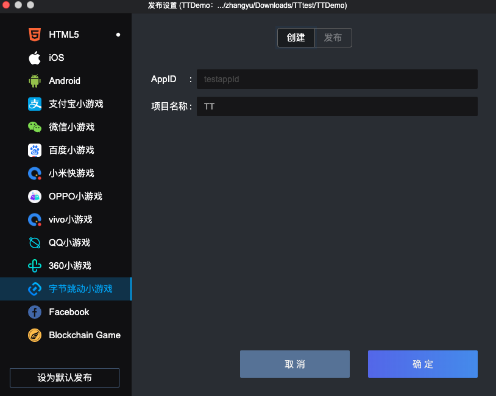

### 一.开发环境准备[​](#一开发环境准备 "一.开发环境准备的直接链接")

- Egret Launcher 1.2.0 以上版本
- 白鹭引擎 5.3.8 以上版本
- 字节跳动小游戏开发者工具，[前往下载](https://microapp.bytedance.com/docs/zh-CN/mini-app/develop/developer-instrument/developer-instrument-update-and-download)
- 注册字节跳动小游戏账号，[开发者平台](https://microapp.bytedance.com/)

### 二.创建小游戏和可视化编译打包小游戏[​](#二创建小游戏和可视化编译打包小游戏 "二.创建小游戏和可视化编译打包小游戏的直接链接")

1.  使用最新的 Egret Launcher 创建一个 Egret 游戏项目，引擎使用 5.3.8 以上版本。 创建完成后，会在 Egret Launcher 的列表里看到该项目。点击发布设置: 
2.  选择 `字节跳动小游戏` 标签，点击`确定`，创建项目 
3.  创建成功后，点击`发布`标签，可以可视化的发布小游戏包 