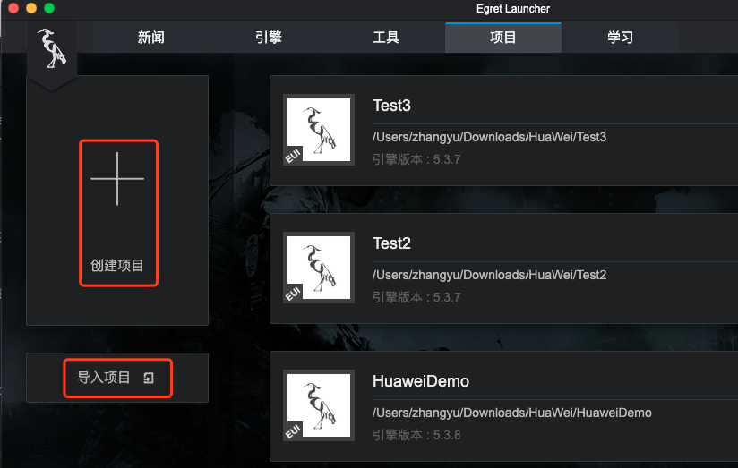
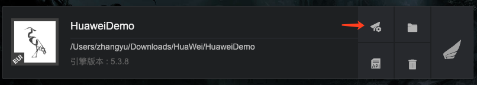
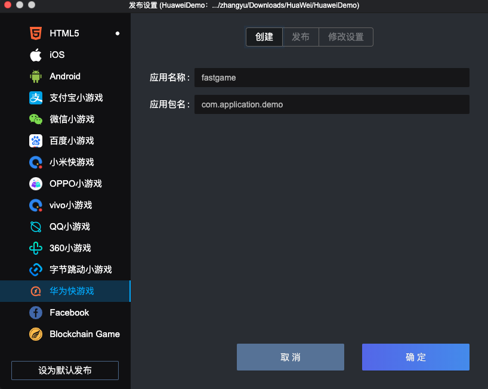
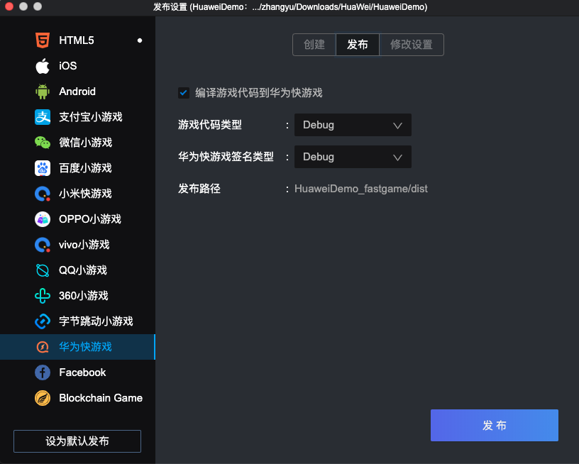
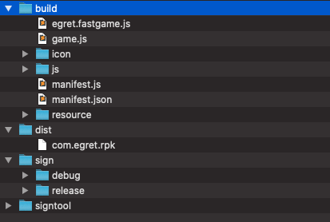
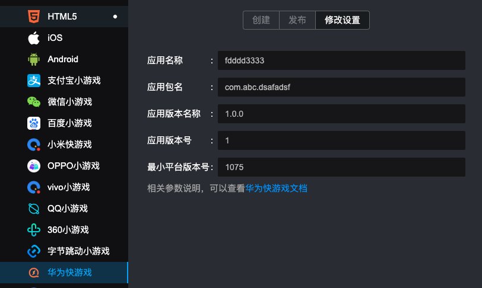
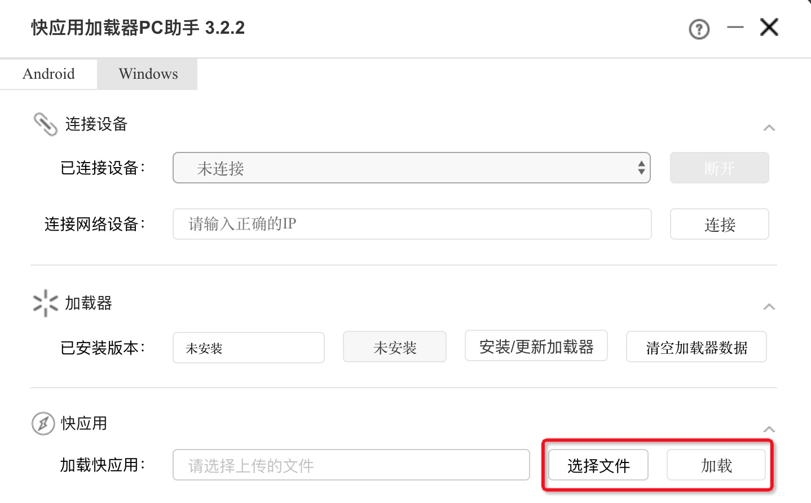
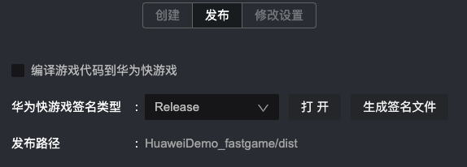
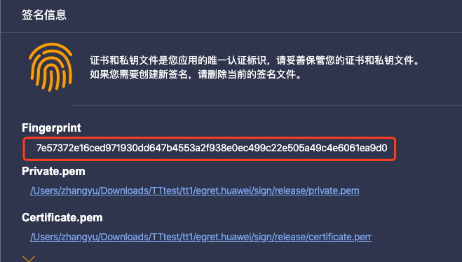
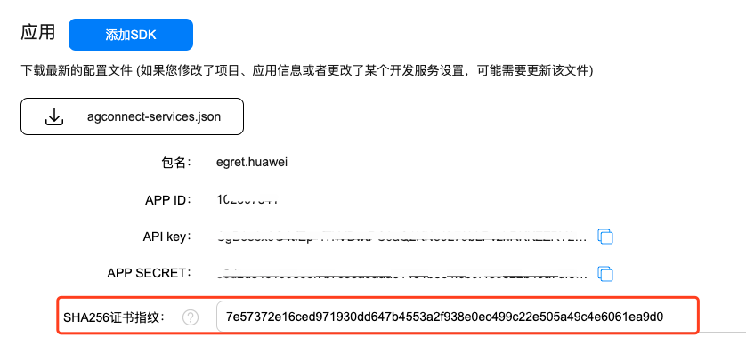

### 一.开发环境准备[​](#一开发环境准备 "一.开发环境准备的直接链接")

- 注册华为快游戏账号，[账号管理后台](https://developer.huawei.com/consumer/cn/service/josp/agc/index.html)
- 账号登陆、用户信息等系统功能，请调用平台提供的 API。[快游戏平台 API 说明](https://developer.huawei.com/consumer/cn/doc/development/quickApp-References/quickgame-api-account)
- [安装华为快应用加载器](https://developer.huawei.com/consumer/cn/doc/development/quickApp-Guides/quickapp-installtool#loader)
- **注意** 最终发布的 rpk 文件总大小不能超过 20 MB。
- 白鹭引擎 5.3.9 以上版本
- Egret Launcher 1.2.1 以上版本

### 二.创建小游戏和可视化编译打包小游戏[​](#二创建小游戏和可视化编译打包小游戏 "二.创建小游戏和可视化编译打包小游戏的直接链接")

1.  使用 Egret Launcher 创建一个 Egret 游戏项目，或者将原有的 Egret 项目导入 
    
2.  导入或者创建完成后，会在 Egret Launcher 的列表里看到该项目。点击发布设置: 
    
3.  选择 `华为快游戏` 标签，点击`确定`，创建快游戏项目 
    
4.  创建成功后，点击`发布`标签，可以可视化的发布小游戏包 **编译游戏代码到华为快游戏**：把白鹭工程里的代码编译到快游戏的项目里
    
    - 游戏代码类型 - debug：js 代码不进行 uglify 混淆，便于 debug 调试
    - 游戏代码类型 - release：js 代码进行 uglify 混淆压缩
5.  点击发布后，会把编译好的 rpk 包生成到 dist 文件夹内
    
6.  华为快游戏项目结构  
    
    
    - build 目录:
        - egret.fastgame.js ：白鹭引擎与快游戏的适配层代码
        - game.js：快游戏的入口文件
        - icon 目录：游戏图标
        - js 目录：游戏的 js 代码
        - manifest.js：用于加载依赖的 js 文件
        - manifest.json ：快游戏的配置文件 [查看具体说明](https://developer.huawei.com/consumer/cn/doc/development/quickApp-Guides/quickgame-develop-runtime-game#manifestDesc)
        - resource : 游戏的图片、音频等资源文件
        - dist 目录：用于存放编译好的 rpk 文件
        - sign：用于存放签名文件
        - signtool：快游戏的编译工具
7.  通过 Launcher 的“修改配置”标签页，可以修改快游戏的相关参数，[查看参数说明文档](https://developer.huawei.com/consumer/cn/doc/development/quickApp-Guides/quickgame-develop-runtime-game#manifestDesc)。
    
    - **注意** 修改参数后，需要重新发布一次 rpk，新的参数才会生效。
    - 最小平台版本号为 1075 

### 三.安装到手机[​](#三安装到手机 "三.安装到手机的直接链接")

- [下载快应用加载器助手](https://developer.huawei.com/consumer/cn/doc/development/quickApp-Guides/quickapp-installtool#h1-1575365509063)
    
- 点击 **选择文件** 选择刚才编译好的 rpk 包，然后点击 **加载** 安装到手机 
    
    ### 四.关于签名文件[​](#四关于签名文件 "四.关于签名文件的直接链接")
    
    华为快游戏的签名分为 debug 和 release 两种。我们提供了默认的 debug 签名，便于开发者打包调试。但如果要使用登陆、用户信息等平台功能，则必须使用 release 签名，[查看生成方式](https://developer.huawei.com/consumer/cn/doc/development/quickApp-Guides/quickapp-generate-fingerprint)。
    
    
    
- 在 Launcher 的发布标签页，签名类型选择 Release ，点击右侧的“打开”按钮，会打开一个文件夹，然后将生成好的签名文件放入。
    
- 再次发布后，生成出来的就是使用 release 签名的 rpk 包
    
- **注意** ，使用华为工具生成的签名，必须将证书指纹，填到快游戏的后台的项目设置中。  
     
    
    ### 五.注意事项[​](#五注意事项 "五.注意事项的直接链接")
    

1.  平台最多支持5个音频对象同时播放