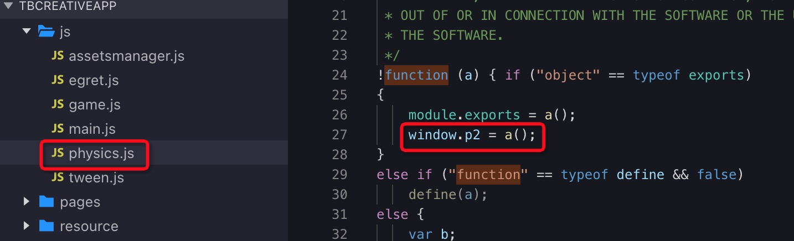

首先，强调一些淘宝创意互动的基础技术限制：

- 不允许操作 DOM、BOM，必须改成平台相应的 API 调用方式
- 不允许动态执行代码的能力，eval、setTimeout 和 setInterval 函数的第一个参数不能为字符串，Function构造函数的参数不能为字符串。
- 同时只能创建6个声音对象，超出的会覆盖掉老的声音对象。

接下来汇总一下开发者普遍遇到的问题以及解决方案：

### 问题[​](#问题 "问题的直接链接")

#### 我在使用白鹭引擎 5.0 / 4.x / 3.x 版本，可以直接转换为淘宝创意互动么？[​](#我在使用白鹭引擎-50--4x--3x-版本可以直接转换为淘宝创意互动么 "我在使用白鹭引擎 5.0 / 4.x / 3.x 版本，可以直接转换为淘宝创意互动么？的直接链接")

答：目前我们只支持白鹭引擎 5.2.19 以上的版本发布为淘宝创意互动。老版本的项目，[参考微信小游戏升级指南](https://docs.egret.com/engine/docs/publish/minigame/wechat/publish)

#### 我在使用 egret res 库，5.2.19 创建的新项目使用的是 assetsmanager 库，这两个库有区别么？[​](#我在使用-egret-res-库5219-创建的新项目使用的是-assetsmanager-库这两个库有区别么 "我在使用 egret res 库，5.2.19 创建的新项目使用的是 assetsmanager 库，这两个库有区别么？的直接链接")

答：assetsmanager 是 res 的替代方案，这两者的 API 有 90% 保持一致，但是仍然有一些小区别，主要是在 RES.Analyzer 上，如果您遇到了相关问题，您可以在 egretProperties.json 中修改模块配置，从 assetsmanager 修改回 res 并执行 egret clean ，这样就可以换成 res 资源管理库了。更改如图所示：

#### 当老项目（5.2.19以前）升到到最新版时，发布小游戏项目报错：[​](#当老项目5219以前升到到最新版时发布小游戏项目报错 "当老项目（5.2.19以前）升到到最新版时，发布小游戏项目报错：的直接链接")

答：升级成功后，请首先保证 HTML5 版本可以正常运行，然后再尝试发布为淘宝创意互动，目前我们遇到了多位开发者通过创建 5.2.19 新项目后拷贝老项目代码和素材的方式尝试升级，由于忽视了修改 egretProperties.json 中的模块配置，导致运行失败的问题。[参考微信小游戏升级指南](https://docs.egret.com/engine/docs/publish/minigame/wechat/publish)

#### 在游戏使用到 egret.getDefinitionByName() 报错，找不到对应类时：[​](#在游戏使用到-egretgetdefinitionbyname-报错找不到对应类时 "在游戏使用到 egret.getDefinitionByName() 报错，找不到对应类时：的直接链接")

答：需要将要反射的类挂载到 window 对象下，例如有个 class People{} 类，需要添加代码 window\["People"\] = People。[参考微信小游戏示例demo](https://docs.egret.com/engine/img/docs/publish/minigame/wechat/minigameFAQ/testglobal.zip)

#### 为什么引入第三方库报 `第三方库 is not defined` 错误.[​](#为什么引入第三方库报-第三方库-is-not-defined-错误 "为什么引入第三方库报-第三方库-is-not-defined-错误的直接链接")

答： 我们要再次强调小游戏有很多的限制，首先检查我们所使用的第三方库是否符合小游戏的标准，具体可以参考小游戏官方文档，如果不符合规范，我们只能自己来修改这个库以达到标准。后期我们会整理常用的库提供给开发者。 经检查适合小游戏的标准，但还是会报我们使用的 `第三放库未定义`，需要我们把第三方库挂在到全局对象 window 上，我们可以在 mygame.ts 的文件中添加。例如我们加入 zlib 库。如图：

#### 在 EUI 中使用自定义组件，发布到淘宝创意互动的 default.thm.js 报错提示找不到自定义组件，错误如图：[​](#在-eui-中使用自定义组件发布到淘宝创意互动的-defaultthmjs-报错提示找不到自定义组件错误如图 "在 EUI 中使用自定义组件，发布到淘宝创意互动的 default.thm.js 报错提示找不到自定义组件，错误如图：的直接链接")

答：参考上一条回答，需要将自定义组件暴露到全局作用域。

#### 使用 P2 物理库，为什么会报错。[​](#使用-p2-物理库为什么会报错 "使用 P2 物理库，为什么会报错。的直接链接")

答：参考[关于全局变量的使用](https://docs.egret.com/engine/docs/publish/minigame/taobao/variable) 

#### 在小游戏中报错 “Main is not defined” 时，[​](#在小游戏中报错-main-is-not-defined-时 "在小游戏中报错 “Main is not defined” 时，的直接链接")

答：请查看游戏的入口类名是否为 Main，如不是请修改为 Main。

#### 使用 eui 皮肤时报错 'parseFromString' of undefined，如何解决。[​](#使用-eui-皮肤时报错-parsefromstring-of-undefined如何解决 "使用 eui 皮肤时报错 'parseFromString' of undefined，如何解决。的直接链接")

答：检查是否使用了 嵌入EXML到代码中，例：

```js
const className = 'skins.ButtonSkin'

const exmlText= 
`<e:Skin class="${className}" states="up,over,down,disabled" xmlns:s="http://ns.egret.com/eui">
...
</e:Skin>`
```

需要改成单独的皮肤文件。

#### 文件加载失败： default.res.json?v=201906191000[​](#文件加载失败-defaultresjsonv201906191000 "文件加载失败： default.res.json?v=201906191000的直接链接")

答：去掉`?v=201906191000`

#### 一个 sound 只能创建一个 soundChannel，怎么同时播放同一个声音[​](#一个-sound-只能创建一个-soundchannel怎么同时播放同一个声音 "一个 sound 只能创建一个 soundChannel，怎么同时播放同一个声音的直接链接")

答：创建多个 sound 的方式，分别播放声音。[参考demo](http://tool.egret-labs.org/DocZip/engine/minigame/Sounds.zip)

**注意**：同时只能创建6个声音对象，超出的会覆盖掉老的声音对象。

```js
for (let i = 0; i < 3; i++) {
 let sd = new egret.Sound()
 sd.load('resource/assets/se1.mp3')
 ...
}
```

#### 为什么我动态设置帧频没有效果[​](#为什么我动态设置帧频没有效果 "为什么我动态设置帧频没有效果的直接链接")

答：小游戏平台只能在 index.html 里设置，不能通过 stage.frameRate 方法动态修改
