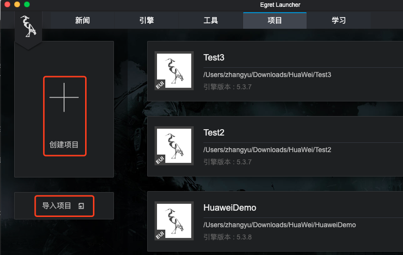
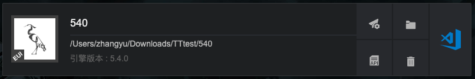
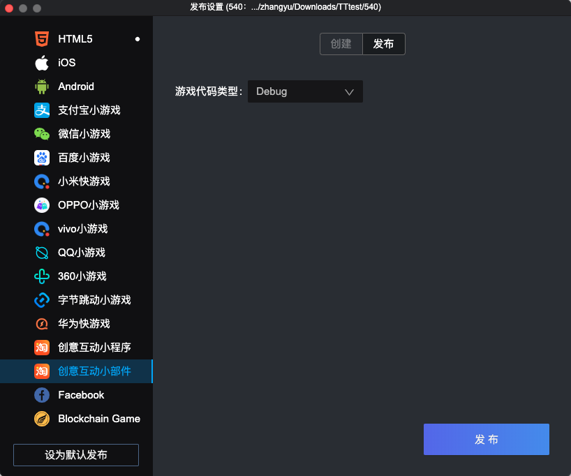
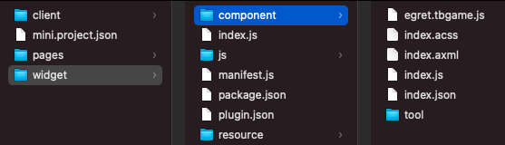
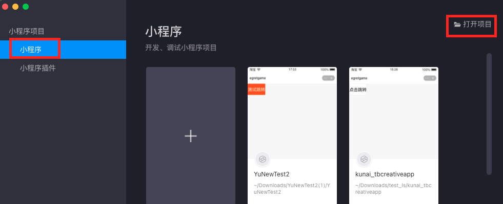
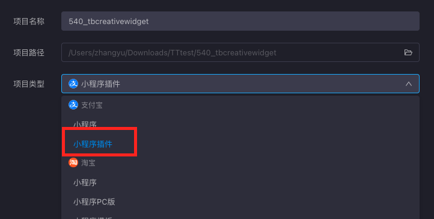

### 一.开发环境准备[​](#一开发环境准备 "一.开发环境准备的直接链接")

- [注册商家应用账号](https://miniapp.open.taobao.com/docV3.htm?spm=a219a.15212435.0.0.7652669aaxjToh&docId=119111&docType=1&)
- [下载淘宝开发工具](https://miniapp.open.taobao.com/docV3.htm?docId=117317&docType=1)
- 用户授权，用户信息等系统功能，请调用平台提供的 API。[平台 API 说明](https://miniapp.open.taobao.com/docV3.htm?docId=988&docType=20&tag=dev)
- [淘宝官方的介绍的开发指南](https://miniapp.open.taobao.com/docV3.htm?docId=119271&docType=1&tag=dev)
- 白鹭引擎版本 5.4.0 以上
- EgretLauncher 版本 1.2.4 以上

### 二.创建小游戏和可视化编译打包小游戏[​](#二创建小游戏和可视化编译打包小游戏 "二.创建小游戏和可视化编译打包小游戏的直接链接")

1.  使用最新版的 Egret Launcher 创建一个 Egret 游戏项目，或者将原有的 Egret 项目导入 
2.  导入或者创建完成后，会在 Egret Launcher 的列表里看到该项目。点击发布设置: 
3.  选择 `创意互动小部件` 标签，点击`确定`，创建淘宝项目
4.  创建成功后，点击`发布`标签，可以可视化的发布小游戏包 
5.  游戏代码类型：把白鹭工程里的代码编译淘宝项目里
    - debug：js 代码不进行 uglify 混淆，便于 debug 调试
    - release：js 代码进行 uglify 混淆压缩
6.  淘宝创意互动项目结构 
    - widget/component 目录： *index.css：小部件的样式文件，一般不需要修改* egret.tbgame.js：白鹭适配层文件
        - index.axml：小部件入口页的页面结构
        - index.js：小部件入口文件
        - index.json：小部件的配置文件
        - tools 文件夹：一些工具类，不要修改
    - widget 目录：
        - js文件夹：白鹭项目编译出来的游戏代码
        - resource文件夹：游戏的图片、音频等资源文件。目前小部件不支持本地文件读取，因此需要把资源部署到网络环境进行加载。
        - manifest.js：用于加载依赖的 js 文件
        - plugin.json：小部件的插件配置 ，[详情参见](https://miniapp.open.taobao.com/docV3.htm?spm=a219a.7386797.0.0.4c3d669aHbpAVt&source=search&docId=119170&docType=1)
    - mini.project.json：用于配置项目用到的文件格式，如果用到了特殊的文件格式，需要在这配置
    - client 文件夹：淘宝创意互动应用主题部分

### 三.安装到手机[​](#三安装到手机 "三.安装到手机的直接链接")

1.  [下载开发者工具](https://miniapp.open.taobao.com/docV3.htm?spm=a219a.15212435.0.0.7652669aaxjToh&docId=117780&docType=1&)
2.  点击【小程序】->【打开项目】，选择刚才创建好的淘宝创意互动小部件项目 
3.  项目类型，选择【小程序插件】 
4.  在面板的左上方关联应用，点击右上方的真机调试，编译完成后，使用手机淘宝APP，扫码调试

### 四.注意事项[​](#四注意事项 "四.注意事项的直接链接")

1.  平台因为安全问题，游戏资源必须通过网络加载，不能放在包里，建议使用 [淘宝云开发](https://miniapp.open.taobao.com/docV3.htm?docId=118541&docType=1&tag=dev)。
2.  加载远程资源时，资源要放在阿里系域名下，具体情况请咨询淘宝的技术支持。
3.  平台提供的文字输入功能很弱，请先测试查看效果。
4.  不支持横屏游戏
5.  iOS 暂时不支持 websock 真机调试，预览模式可以使用。
6.  不能直接调用 window 对象，需要使用 `$global.window`
7.  暂时不支持声音播放等功能，请以官方说明和真机测试为准。
8.  暂时不支持 setInterval 方法，请以官方说明和真机测试为准。
9.  暂时不支持 加载本地文件，请以官方说明和真机测试为准。
10. 其他问题，请参考:[淘宝创意互动小程序FAQ](https://docs.egret.com/engine/docs/publish/minigame/taobao/tbgameFAQ)

### 五.全局变量的使用[​](#五全局变量的使用 "五.全局变量的使用的直接链接")

淘宝创意互动项目不支持全局变量，具体使用方式，[请看这篇教程文档](https://docs.egret.com/engine/docs/publish/minigame/taobao/variable)